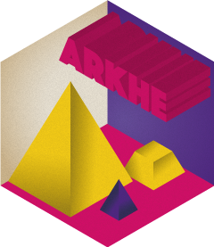

<!-- README.md is generated from README.Rmd. Please edit that file -->

# arkhe 

<!-- badges: start -->

[](https://cran.r-project.org/package=arkhe)

<a href="https://tesselle.r-universe.dev/arkhe"
class="pkgdown-devel"></a>
<a href="https://cran.r-project.org/package=arkhe"
class="pkgdown-release"></a>
<a href="https://cran.r-project.org/web/checks/check_results_arkhe.html"
class="pkgdown-release"></a>
<a href="https://cran.r-project.org/package=arkhe"
class="pkgdown-release"></a>

[](https://www.repostatus.org/#active)

[](https://doi.org/10.5281/zenodo.3526659)
<!-- badges: end -->

## Overview

A dependency-free collection of simple functions for cleaning
rectangular data. This package allows to detect, count and replace
values or discard rows/columns using a predicate function. In addition,
it provides tools to check conditions and return informative error
messages.

------------------------------------------------------------------------

To cite arkhe in publications use:

Frerebeau N (2025). *arkhe: Tools for Cleaning Rectangular Data*.
Université Bordeaux Montaigne, Pessac, France.
<doi:10.5281/zenodo.3526659> <https://doi.org/10.5281/zenodo.3526659>, R
package version 1.10.0, <https://packages.tesselle.org/arkhe/>.

This package is a part of the tesselle project
<https://www.tesselle.org>.

## Installation

You can install the released version of **arkhe** from
[CRAN](https://CRAN.R-project.org) with:

``` r
install.packages("arkhe")
```

And the development version from [Codeberg](https://codeberg.org/) with:

``` r
# install.packages("remotes")
remotes::install_git("https://codeberg.org/tesselle/arkhe")
```

## Usage

``` r
## Load the package
library(arkhe)

## Set seed for reproductibility
set.seed(12345)

## Create a matrix
X <- matrix(sample(1:10, 25, TRUE), nrow = 5, ncol = 5)

## Add NA
k <- sample(1:25, 3, FALSE)
X[k] <- NA
X
#>      [,1] [,2] [,3] [,4] [,5]
#> [1,]    3    2    1    4    4
#> [2,]   10    6    8    8   10
#> [3,]    8   NA    7   10    7
#> [4,]   NA   NA    6    3    2
#> [5,]    8   10    1    9    4

## Count missing values in rows
count(X, f = is.na, margin = 1)
#> [1] 0 0 1 2 0

## Count non-missing values in columns
count(X, f = is.na, margin = 2, negate = TRUE)
#> [1] 4 3 5 5 5

## Find row with NA
detect(X, f = is.na, margin = 1)
#> [1] FALSE FALSE  TRUE  TRUE FALSE

## Find column without any NA
detect(X, f = is.na, margin = 2, negate = TRUE, all = TRUE)
#> [1] FALSE FALSE  TRUE  TRUE  TRUE

## Remove row with any NA
discard(X, f = is.na, margin = 1, all = FALSE)
#>      [,1] [,2] [,3] [,4] [,5]
#> [1,]    3    2    1    4    4
#> [2,]   10    6    8    8   10
#> [3,]    8   10    1    9    4

## Remove column with any NA
discard(X, f = is.na, margin = 2, all = FALSE)
#>      [,1] [,2] [,3]
#> [1,]    1    4    4
#> [2,]    8    8   10
#> [3,]    7   10    7
#> [4,]    6    3    2
#> [5,]    1    9    4

## Replace NA with zeros
replace_NA(X, value = 0)
#>      [,1] [,2] [,3] [,4] [,5]
#> [1,]    3    2    1    4    4
#> [2,]   10    6    8    8   10
#> [3,]    8    0    7   10    7
#> [4,]    0    0    6    3    2
#> [5,]    8   10    1    9    4
```

## Translation

This package provides translations of user-facing communications, like
messages, warnings and errors. The preferred language is by default
taken from the locale. This can be overridden by setting of the
environment variable `LANGUAGE` (you only need to do this once per
session):

``` r
Sys.setenv(LANGUAGE = "<language code>")
```

Languages currently available are English (`en`) and French (`fr`).

## Contributing

Please note that the **arkhe** project is released with a [Contributor
Code of Conduct](https://www.tesselle.org/conduct.html). By contributing
to this project, you agree to abide by its terms.
